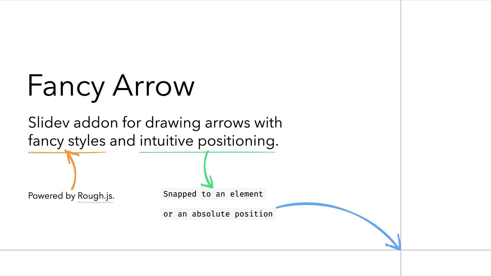

# slidev-addon-fancy-arrow

Slidev addon for adding fancy arrows to your slides, powered by [Rough.js](https://roughjs.com/).

[](https://whitphx.github.io/slidev-addon-fancy-arrow/)

[👉 Check out the demo and docs](https://whitphx.github.io/slidev-addon-fancy-arrow/).

## Installation

```bash
npm install slidev-addon-fancy-arrow
```

## Slidev configuration

```yml
---
addons:
  - fancy-arrow
---
```

## Usage

[👉 Check out the demo and docs](https://whitphx.github.io/slidev-addon-fancy-arrow/).

### Basic Examples

#### Absolute positions

```html
<FancyArrow from="(10, 20)" to="(30, 40)" />
```

#### Snapped to elements

```html
<div data-id="anchor1" m-8>anchor1</div>
<div data-id="anchor2" m-8>anchor2</div>
<FancyArrow from="[data-id=anchor1]" to="[data-id=anchor2]" />
<FancyArrow from="[data-id=anchor1]@bottom" to="[data-id=anchor2]@top" />
```

#### Configure the styles

```html
<FancyArrow
  color="orange"
  width="4"
  two-way
  head-type="polygon"
  head-size="40"
  roughness="2"
  bowing="0.5"
  seed="42"
  arc="0.5"
  from="(100, 200)"
  to="(300, 400)"
/>
```

#### Animation

```html
<FancyArrow
  from="(100, 200)"
  to="(300, 400)"
  animated
  animation-duration="1000"
  animation-delay="500"
/>
```
