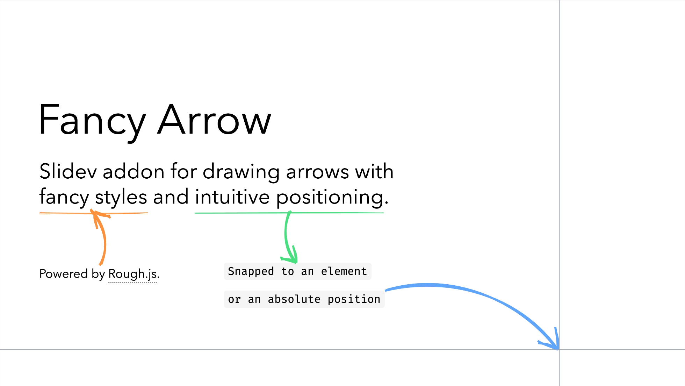

# slidev-addon-fancy-arrow

Slidev addon for adding fancy arrows to your slides, powered by [Rough.js](https://roughjs.com/).

[](https://www.npmjs.com/package/slidev-addon-fancy-arrow)

[](https://whitphx.github.io/slidev-addon-fancy-arrow/)

[👉 Check out the demo and docs](https://whitphx.github.io/slidev-addon-fancy-arrow/).

## Installation

```bash
npm install slidev-addon-fancy-arrow
```

The addon uses the Vue and Slidev instances your deck already has instead of installing its own, so it needs `vue` `^3.5.0` and Slidev 51 or 52. `@slidev/client` comes with `@slidev/cli`, so there is nothing extra to install.

## Slidev configuration

Add the `addons` option in your [headmatter](https://sli.dev/custom/#headmatter) with `fancy-arrow`:

```yml
---
addons:
  - fancy-arrow
---
```

See also: https://sli.dev/guide/theme-addon#use-addon

## Usage

[👉 Check out the demo and docs](https://whitphx.github.io/slidev-addon-fancy-arrow/).

### Absolute positions

```html
<FancyArrow from="(10, 20)" to="(30, 40)" />
```

### Snapped to elements

#### Bind to elements via selectors

```html
<div data-id="anchor1" m-8>anchor1</div>
<div data-id="anchor2" m-8>anchor2</div>
<FancyArrow from="[data-id=anchor1]" to="[data-id=anchor2]" />
<FancyArrow from="[data-id=anchor1]@bottom" to="[data-id=anchor2]@top" />
```

#### Define the snapped elements via `tail` and `head` slots

```html
<FancyArrow>
  <template #tail>
    <span m-8>Tail</span>
  </template>
  <template #head>
    <span m-8>Head</span>
  </template>
</FancyArrow>
```

### Configure the styles

```html
<FancyArrow
  color="orange"
  width="4"
  line-style="dashed"
  two-way
  head-type="polygon"
  head-size="40"
  roughness="2"
  bowing="0.5"
  seed="42"
  arc="0.5"
  from="(100, 200)"
  to="(300, 400)"
/>
```

#### Color

`color` accepts either a [UnoCSS](https://unocss.dev/) color token or a plain CSS color value.

```html
<FancyArrow color="orange" from="(100, 200)" to="(300, 400)" />
<FancyArrow color="#ff8800" from="(100, 200)" to="(300, 400)" />
<FancyArrow color="var(--my-color)" from="(100, 200)" to="(300, 400)" />
<FancyArrow color="rgb(255 136 0)" from="(100, 200)" to="(300, 400)" />
```

A UnoCSS token takes effect only when UnoCSS generates the matching `text-*` utility, and it does not always do so for a token that appears in this prop alone. To force one, add it to `safelist` in your deck's `uno.config.ts`, or use it as a class somewhere in the deck.

A CSS color value has no such caveat, so prefer it when a token has no effect. Note that for a name that is both a CSS color and a UnoCSS token, such as `orange` or `lime`, the token wins wherever UnoCSS generated the utility, so reach for an unambiguous form like `#a3e635` or `var(--my-color)` when the exact color matters.

#### Line style

`line-style` accepts `solid` (the default), `dashed`, or `dotted`.

```html
<FancyArrow line-style="dashed" from="(100, 200)" to="(300, 400)" />
<FancyArrow line-style="dotted" from="(100, 200)" to="(300, 400)" />
```

The dash pattern scales with `width`, and applies to the line only so that the arrow head stays readable at any size.

### Animation

An arrow draws itself once each time it appears. Once it has finished drawing, an arrow whose endpoints move follows them without drawing itself again for as long as it stays on screen.

#### Animation properties

```html
<FancyArrow from="(100, 200)" to="(300, 400)" duration="1000" delay="500" />
```

#### Disable animation

```html
<FancyArrow from="(100, 200)" to="(300, 400)" static />
```

## Development

```bash
pnpm install
pnpm dev     # live demo at http://localhost:3030
pnpm test
pnpm lint
```

`scripts/screenshot.js` renders a slide from a running dev server to a PNG, for environments with no browser to open the slides in.

```bash
node scripts/screenshot.js 3                    # writes screenshots/slide-3.png
node scripts/screenshot.js 3 shot.png --clicks 2
```

It reads the dev server at `http://localhost:3030` unless `--url` says otherwise, and it drives whichever Chrome it finds on the machine, or the one `CHROME_PATH` points at. Where there is none, `npx @puppeteer/browsers install chrome@stable --path ~/.cache/chrome` downloads one and prints the path to set `CHROME_PATH` to.
